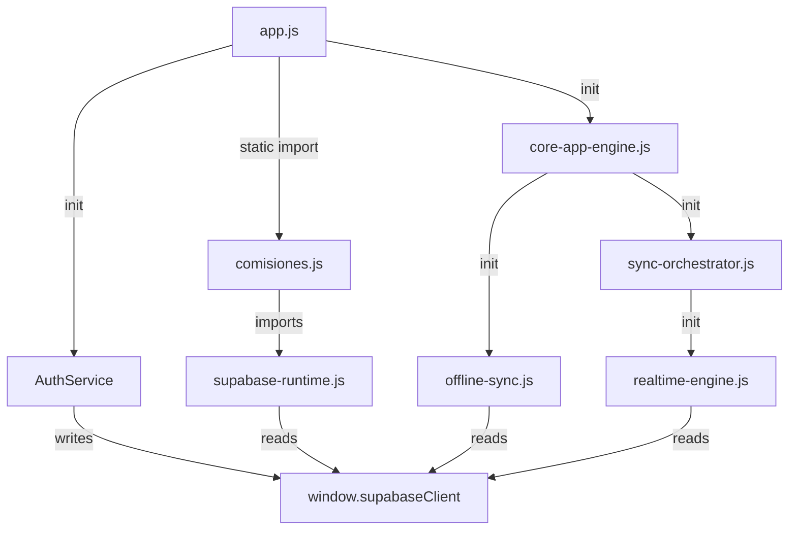
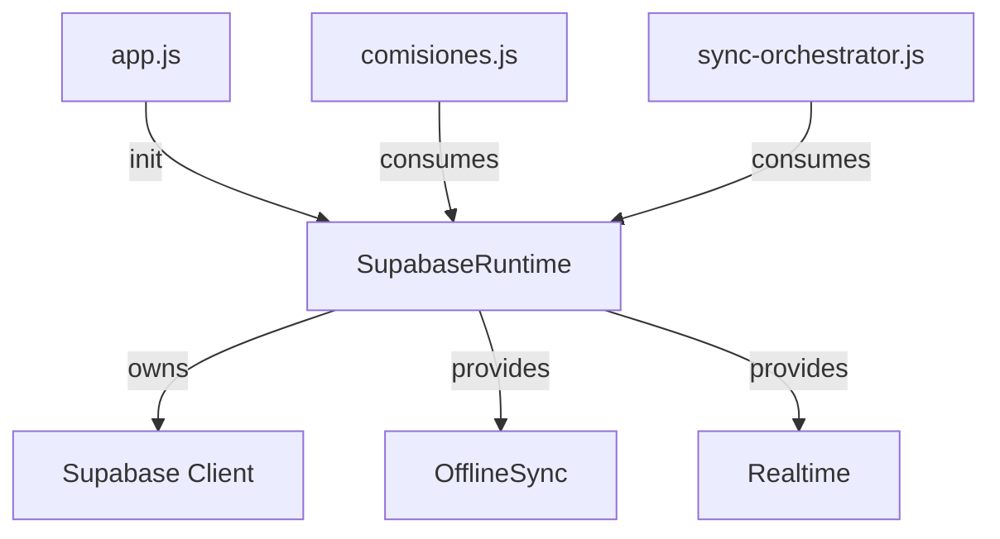

# RUNTIME-010 Infrastructure Ownership Map

## 1. Current State (Unconsolidated)

**Key Issue:** Three separate components (`supabase-runtime.js`, `offline-sync.js`, `realtime-engine.js`) all depend on a global side-effect created by `app.js`.

## 2. Target State (Consolidated Platform)

**Ownership Flow:**
1. **Platform** owns `SupabaseRuntime`.
2. `SupabaseRuntime` owns the **Supabase Client**.
3. **Infrastructure Services** (`OfflineSync`, `Realtime`) consume the client via `SupabaseRuntime`.
4. **App Shell** initializes the Platform.
5. **Domain Routes** consume the Platform.

## 3. Blast Radius Analysis

| File | Change Type | Impact | Risk |
| --- | --- | --- | --- |
| `offline-sync.js` | Replace `window.supabaseClient` with `SupabaseRuntime.getClient()` | Internal refactor | MEDIUM_RISK |
| `realtime-engine.js` | Replace `window.supabaseClient` with `SupabaseRuntime.getClient()` | Internal refactor | MEDIUM_RISK |
| `supabase-runtime.js` | Add Realtime/Sync exports or registration | API extension | LOW_RISK |
| `app.js` | Simplify AuthService; remove global write | Initialization update | LOW_RISK |
| `sync-orchestrator.js` | Update imports (if engines move) | Consumer update | LOW_RISK |

**Consumer Count:** 4
**Dependency Count:** 3
**Runtime Impact:** High (All data mutations and realtime updates flow through these engines).
